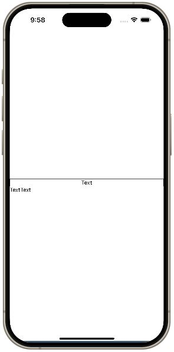

# Lec06

## 01. Quiz_snack-style-box

- props

## 02. Quiz_snack-style-box-toggle

- 조건부 렌더링

## 03. Quiz_snack-counter

- useState

## 04. snack-flex-app

- flex

## 05. snack-flex-app-02

- flex
- flex-direction
- justify-countent
- align-items