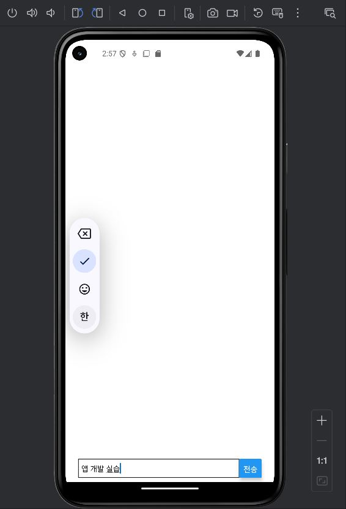
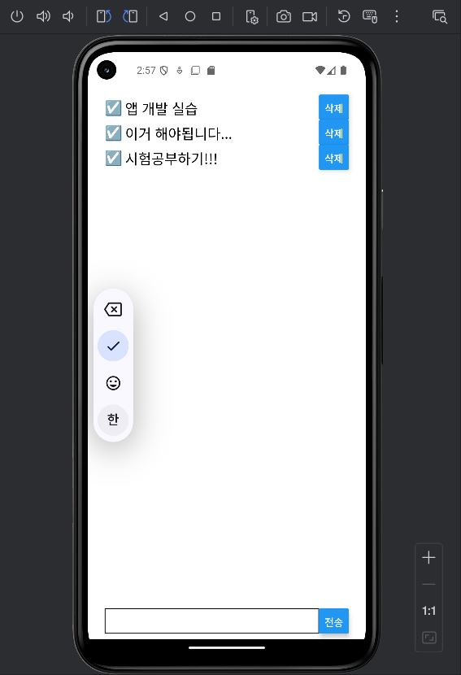
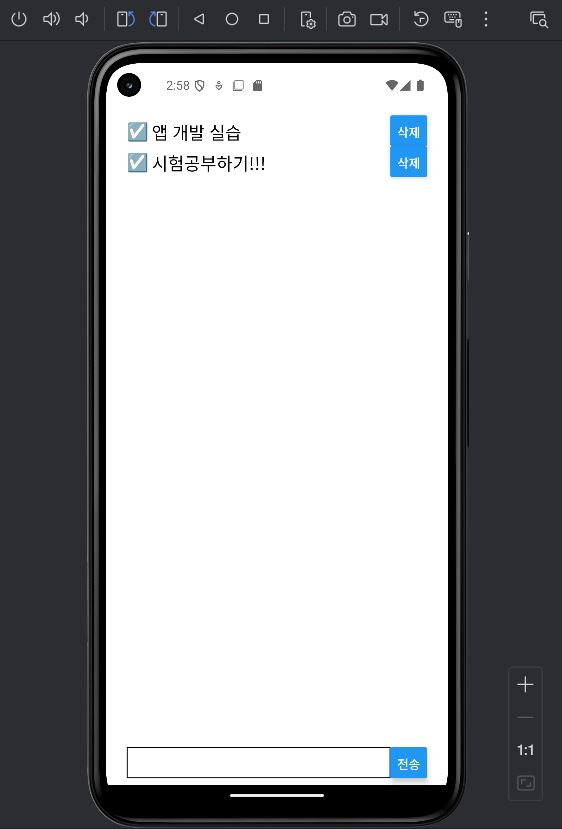

# Lec09
간단한 투두 리스트 앱

## 화면
 | | |
| --- | --- | --- |
| **입력** | **목록** | **삭제 후** |

## 프로젝트 생성
```Shell
npm install -g expo-cli
```
```Shell
npx create-expo-app --template
- Blank
- SimpleTodo
```
## 설치
```Shell
npm i styled-components --force  
npm i lodash immer --force
npm i @react-native-async-storage/async-storage --force
```
- SimpleTodo 에서 설치해야 한다