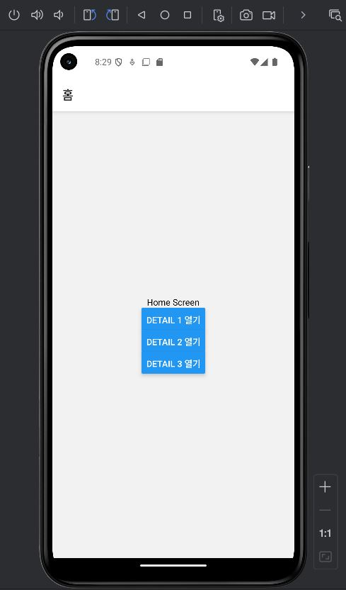

# Lec11
스택 내비게이션
## 화면
 | |
| --- | --- |
| **홈 화면** | **페이지이동** | 

## 프로젝트 생성
```Shell
npx create-expo-app --template
- Blank
- navEx
```
## 설치
```Shell
npm i @react-native-async-storage/async-storage --force
npm install @react-navigation/native
npx expo install react-native-screens react-native-safe-area-context
npm install @react-navigation/native-stack
```