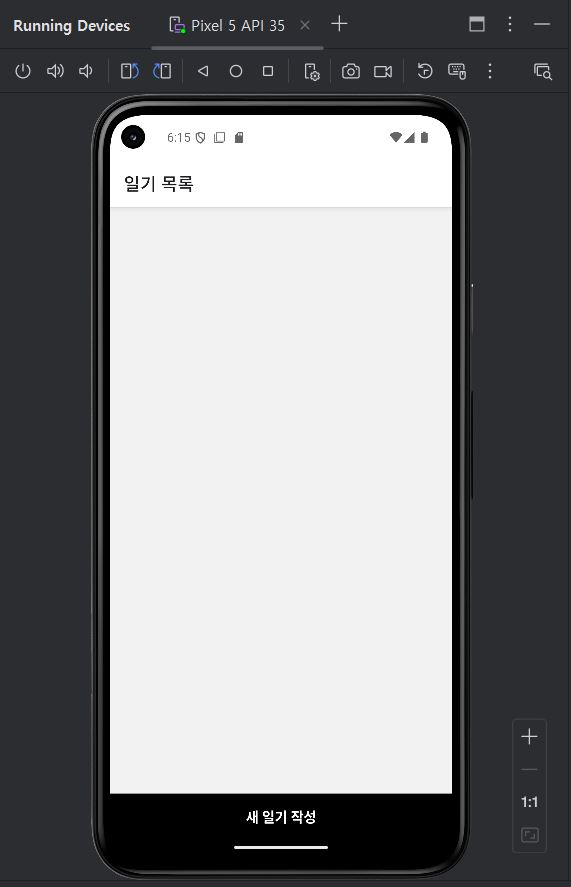
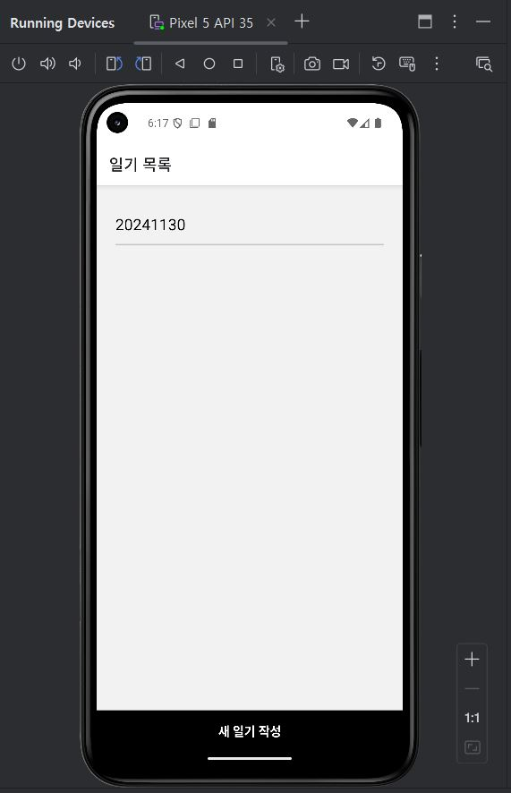
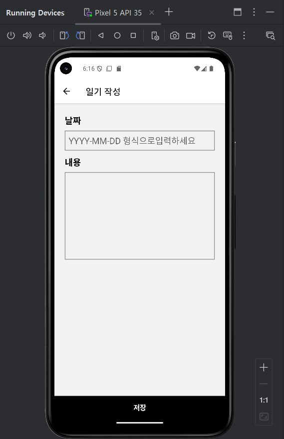
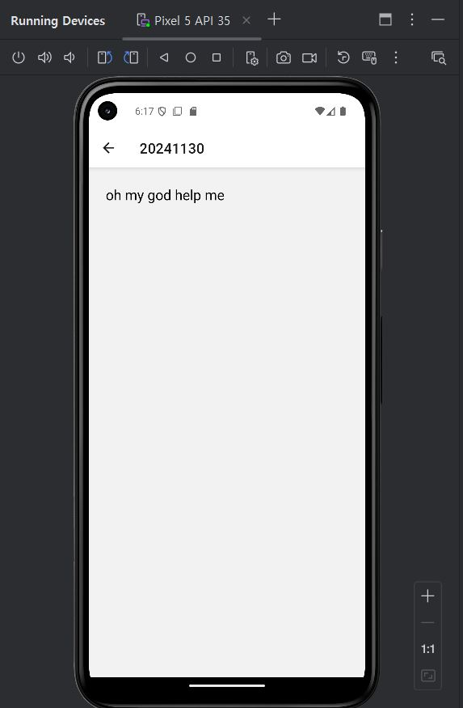

# Lec12
다이어리 앱

## 화면

 | | | 
| --- | --- | --- | --- |
| **메인화면** | **일기추가후** | **일기작성화면** | **일기내용확인** |


## 프로젝트 생성
```Shell
npx create-expo-app --template
- Blank
- Diary
```
## 설치
```Shell
npm i styled-components --force
npm i lodash immer --force
npm i @react-native-async-storage/async-storage --force
npm install @react-navigation/native
npx expo install react-native-screens react-native-safe-area-context
npm install @react-navigation/native-stack
expo install @react-native-async-storage/async-storage
npm i styled-components lodash
```