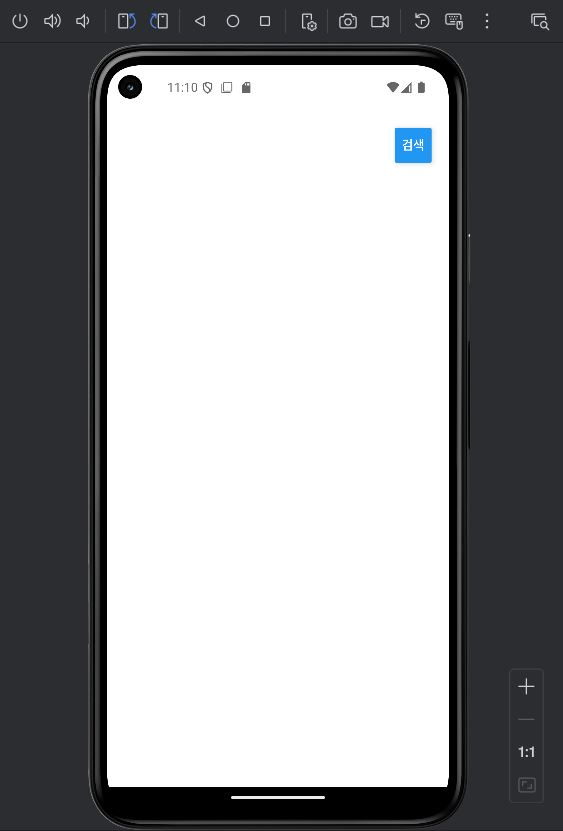
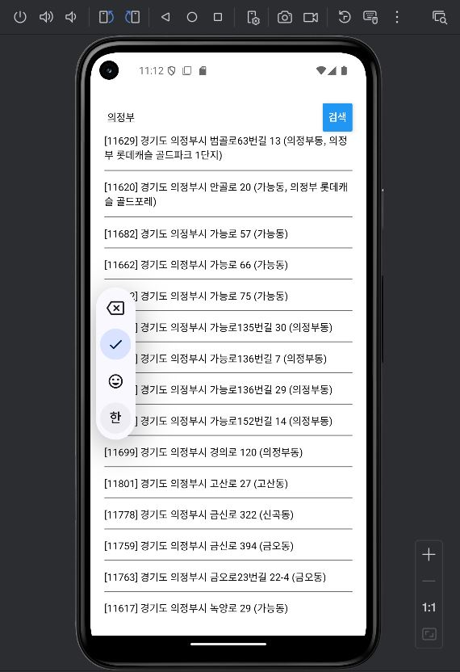
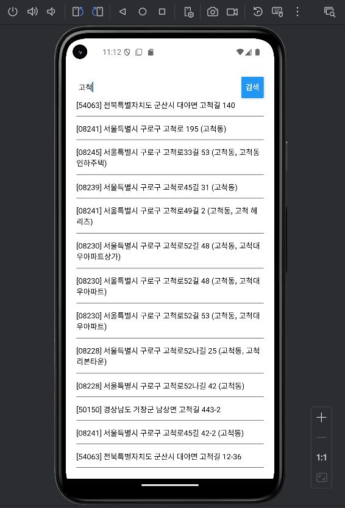

# Lec 13
open api 를 이용한 주소 검색 앱

## 화면
 | | |
| --- | --- | --- |
| **검색화면** | **검색결과화면** | **검색결과화면** |

## 프로젝트 생성
```Shell
npx create-expo-app --template
- Blank
- ZipcodeFinder
```
## 설치
```Shell
npm install axios
```