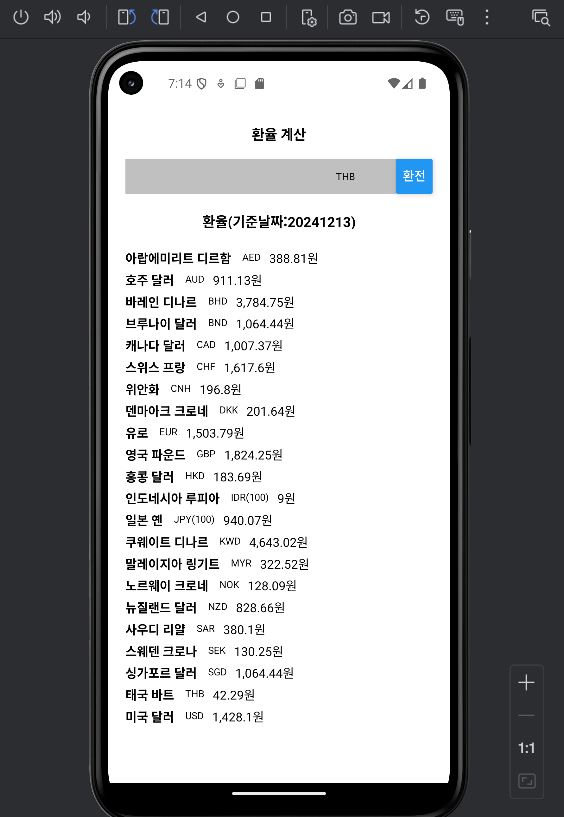
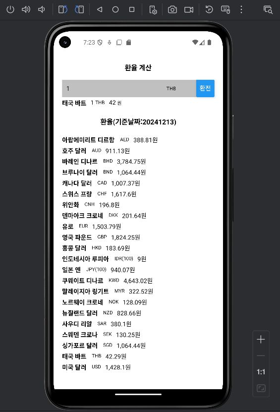

# Lec 14
open api 를 이용한 환율 확인 앱

**Open API**
- https://www.koreaexim.go.kr/ir/HPHKIR019M01

## 화면
 | |
| --- | --- |
| **검색화면** | **태국환전결과화면** |

## 프로젝트 생성
```Shell
npx create-expo-app --template
- Blank
- Exchange
```
## 설치
```Shell
npm install axios
npm i lodash immer --force
npm i @react-native-async-storage/async-storage --force
```